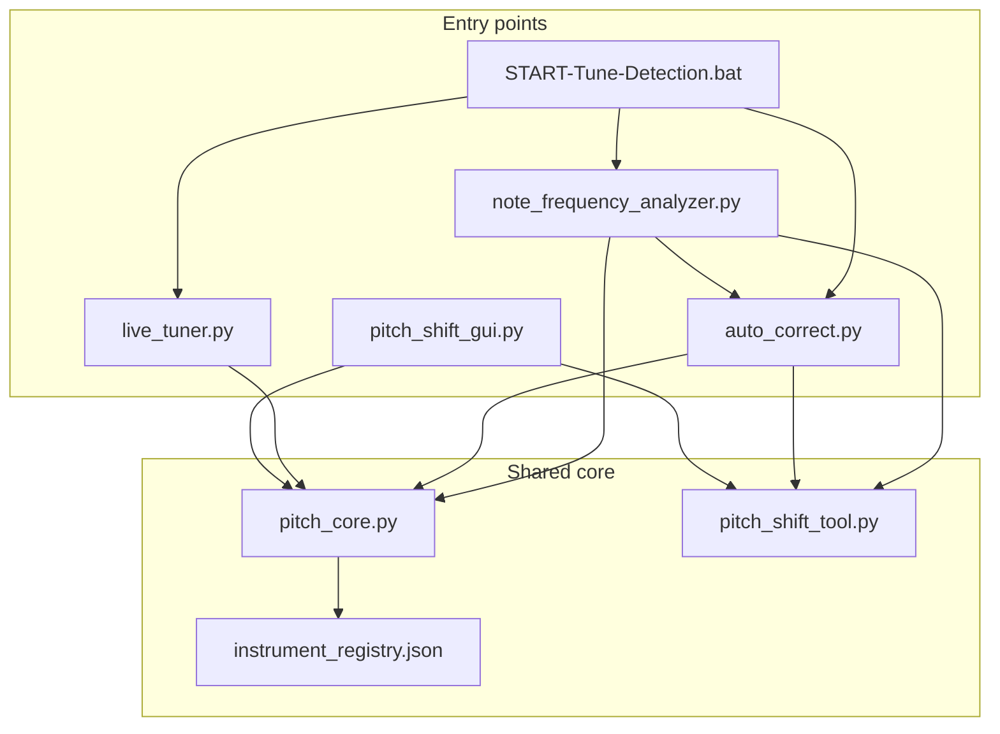
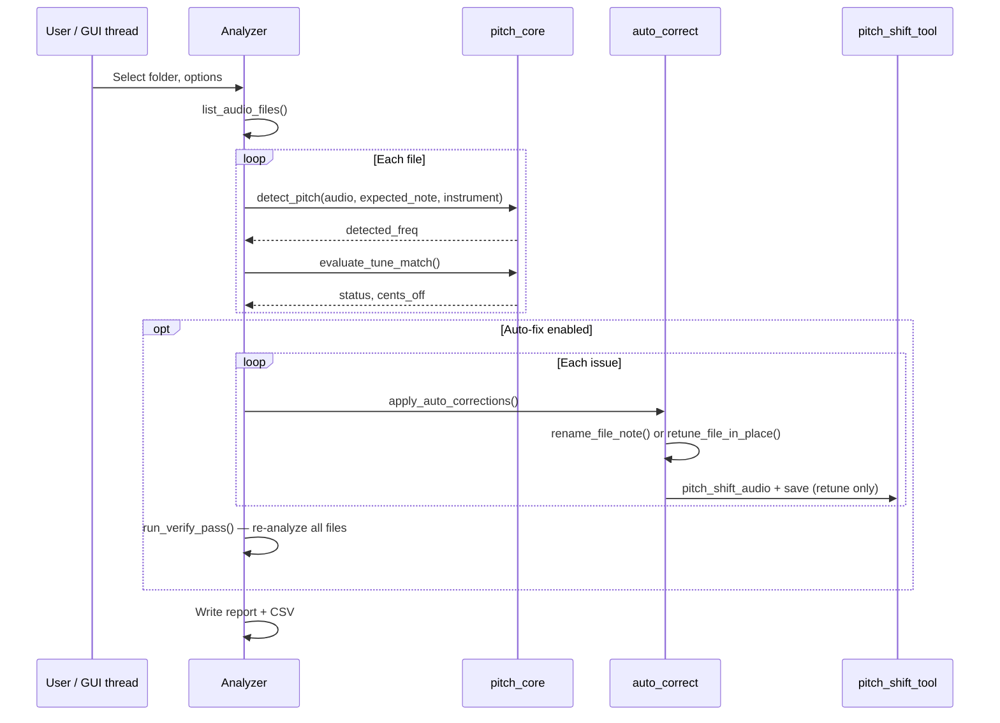
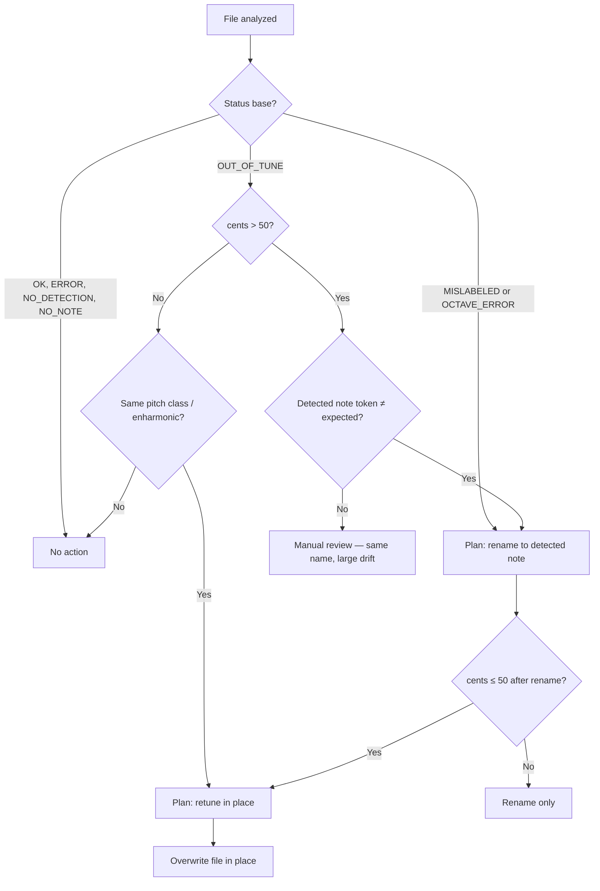
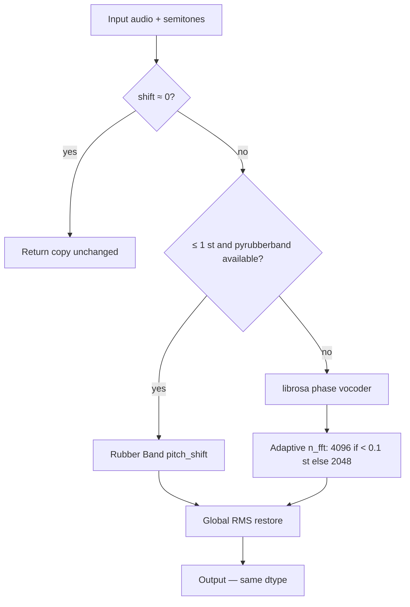

# Tune Detection B — Technical Manual

**Version 2.3 · June 2026**

This document is the full technical reference for **Tune Detection B**, a pitch-analysis and sample-correction toolkit for monophonic audio libraries where each filename encodes the intended note (e.g. `Violin_A4_sustain.wav`, `A#2.aif`).

---

## Table of contents

1. [Purpose and scope](#1-purpose-and-scope)
2. [System requirements](#2-system-requirements)
3. [Architecture](#3-architecture)
4. [Pitch detection pipeline](#4-pitch-detection-pipeline)
5. [Note parsing and filename rules](#5-note-parsing-and-filename-rules)
6. [Classification and status codes](#6-classification-and-status-codes)
7. [Auto-correction engine](#7-auto-correction-engine)
8. [Pitch shifting and audio I/O](#8-pitch-shifting-and-audio-io)
9. [Note Frequency Analyzer (GUI)](#9-note-frequency-analyzer-gui)
10. [Command-line interface](#10-command-line-interface)
11. [Batch subfolder processing](#11-batch-subfolder-processing)
12. [Instrument registry](#12-instrument-registry)
13. [Reports and exports](#13-reports-and-exports)
14. [Live Tuner and manual pitch tools](#14-live-tuner-and-manual-pitch-tools)
15. [API reference](#15-api-reference)
16. [Constants and configuration](#16-constants-and-configuration)
17. [Testing](#17-testing)
18. [Troubleshooting](#18-troubleshooting)
19. [Design rationale](#19-design-rationale)

---

## 1. Purpose and scope

### What it does

| Capability | Description |
|------------|-------------|
| **Detect pitch** | Estimate fundamental frequency from monophonic recordings |
| **Compare to filename** | Parse expected note from filename; compute cents deviation |
| **Classify issues** | In-tune, out-of-tune, mislabeled, octave error, no detection |
| **Auto-fix** | Retune (small drift) or rename (wrong note / large drift) |
| **Batch QC** | Analyze one folder or many subfolders sequentially |
| **Report** | Write text report + CSV into the analyzed folder |

### Intended use

- Orchestral / sample-library preparation (strings, winds, brass, etc.)
- Iowa-style note-per-file corpora (`A4.aif`, `C#3.wav`, …)
- Quality control before mapping samples to samplers or DAWs

### Out of scope

- Polyphonic music analysis
- Files without a parseable note token in the filename
- Automatic deletion of duplicate or bad takes (renames use `_2`, `_3`, … instead)
- Merging multiple folders into one analysis (batch processes each folder separately; it does not flatten all files into one list)

---

## 2. System requirements

### Software

| Component | Minimum | Notes |
|-----------|---------|-------|
| Python | 3.10+ | Tested on Windows 10/11 |
| pip packages | See `requirements.txt` | `librosa`, `numpy`, `soundfile`, `sounddevice`, `pytest` |
| ffmpeg | Optional | Required for MP3/M4A/WMA write via pitch tools; fallback for `.aif` save |

### Install

```bash
cd "tune detection_B"
pip install -r requirements.txt
```

### Windows launcher

| Entry point | Action |
|-------------|--------|
| `START-Tune-Detection.bat` | Opens GUI directly |
| `START-Tune-Detection.bat menu` | Menu: GUI, CLI, batch CLI, Live Tuner |
| `START-Tune-Detection.bat cli` | CLI auto-correct (single folder) |
| `START-Tune-Detection.bat tuner` | Live Tuner |

### Supported audio formats (read)

`.wav`, `.mp3`, `.flac`, `.ogg`, `.aif`, `.aiff`, `.m4a`, `.wma` (via librosa; write support varies — see [§8](#8-pitch-shifting-and-audio-io)).

---

## 3. Architecture

### Module graph



### File responsibilities

| File | Role |
|------|------|
| `pitch_core.py` | Note math, parsing, detection algorithms, instrument range checks |
| `auto_correct.py` | Correction planning, rename/retune, CLI, batch orchestration |
| `note_frequency_analyzer.py` | Main Tkinter GUI, threading, reports, manual overrides |
| `pitch_shift_tool.py` | Phase-vocoder shift, format-preserving save, CLI pitch tool |
| `pitch_shift_gui.py` | Standalone/manual pitch-shift GUI (launched from analyzer) |
| `live_tuner.py` | Real-time playback + fast pitch meter |
| `instrument_registry.json` | Per-instrument sounding ranges |
| `tests/` | Unit tests (`test_pitch_core`, `test_auto_correct`, `test_pitch_shift_tool`) |

### Data flow (analyze + auto-fix)



---

## 4. Pitch detection pipeline

### Overview

Detection is **monophonic** and optimized for **sustained or stable** single-note samples. The pipeline has three tiers:

1. **Standard** — `detect_frequency()` — general use, fixed search range C2–C8
2. **Filename-guided** — `detect_pitch()` — uses expected note + optional instrument for adaptive bounds and octave resolution
3. **Robust** — `detect_frequency_robust()` — multiple segments and confidence levels when standard detection fails

The GUI uses `detect_pitch()` when **Fix octave errors** is enabled (default ON).

### Step-by-step (`detect_pitch`)

| Step | Function | Description |
|------|----------|-------------|
| 1 | `pitch_search_bounds()` | Compute `fmin`, `fmax` from expected note and/or instrument |
| 2 | `select_stable_segment()` | Extract middle 2 s (or full file if shorter) |
| 3 | `_collect_pitch_candidates()` | Run pYIN → YIN → autocorrelation |
| 4 | `_merge_candidates()` | Pick best frequency; merge close candidates (< 50 ct) |
| 5 | `_detect_raw_frequency_robust()` | Fallback if step 3–4 return 0 |
| 6 | `resolve_fundamental_octave()` | Harmonic template scoring; optional filename octave align |

### Candidate collectors

| Method | Library | Default confidence | Priority |
|--------|---------|-------------------|----------|
| pYIN | `librosa.pyin` | ≥ 0.7 | Highest |
| pYIN (relaxed) | voiced frames only | ~0.56 effective | Medium |
| YIN | `librosa.yin` | 0.6 | Lower |
| Autocorrelation | Custom | 0.55 | Fallback |

Merged result prefers higher confidence; autocorrelation is used alone when `fast=True` (Live Tuner).

### Adaptive search bounds (`pitch_search_bounds`)

Low orchestral notes (double bass A1, tuba, etc.) require `fmin` **below C2 (~65 Hz)**. Without this, detectors lock onto **harmonics** (e.g. C3 at 131 Hz instead of A#1 at 58 Hz).

**Rules:**

- Default `fmin` = 65.41 Hz (C2), `low_limit` = 27.5 Hz (A0)
- If **instrument** is set: read `sounding_range` from registry; extend `low_limit` to 85% of lowest note Hz
- If **expected_note** is set:
  - `fmin = min(DEFAULT_FMIN, max(low_limit, expected_hz × 0.55))`
  - `fmax = min(C8, max(expected_hz × 2.5, fmin + 50))`

**Example:** Expected `A#1` (58 Hz) → `fmin ≈ 32 Hz`, `fmax ≈ 145 Hz`, allowing octave folding to find the true fundamental.

### Octave resolution (`resolve_fundamental_octave`)

Orchestral spectra often have weak fundamentals and strong harmonics. This function:

1. Builds octave-shifted candidates (±3 octaves) within `[fmin, fmax]`
2. Scores each with `_harmonic_coherence_score()` (energy at f0, 2f0, 3f0, …; penalizes strong subharmonic)
3. On ambiguous octave ties, prefers candidate closest to raw detector output
4. If `expected_note` is set and result is > 400 ct off, applies `align_frequency_to_expected_octave()` when it improves match by > 80 ct

### Live Tuner difference

`live_tuner.py` calls `detect_frequency(..., fast=True)`, which **skips** harmonic octave correction and uses autocorrelation only — optimized for low latency during playback.

---

## 5. Note parsing and filename rules

### Note token pattern

Regex: `([A-G])([#♯b♭]?)(-?\d+)` (case-insensitive)

Supported spellings: `A4`, `Bb3`, `C#2`, `F#5`, Unicode sharps/flats.

Enharmonic normalization: `Bb` → `A#`, `Db` → `C#`, etc. (internal); display may preserve user spelling via `display_note_token()`.

### Filename extraction (`parse_note_from_filename`)

**Default strategy:** `rightmost_longest`

- Finds **all** note tokens in the stem
- Selects the **rightmost** match; ties broken by **longest span**

| Filename | Extracted note | Reason |
|----------|----------------|--------|
| `Violin_A4_sustain.wav` | A4 | Only token |
| `take_A4_C5.wav` | C5 | Rightmost |
| `A#2.aif` | A#2 | Direct |
| `OrchSol_Cr.Baixo_F#2-ff-2c-N.wav` | F#2 | Ignores velocity suffix false match |

Alternative: `strategy="first"` returns the leftmost token.

### Valid octave filter

Only octaves **0–8** are accepted. This blocks spurious tokens from velocity / round-robin suffixes:

| Filename fragment | Would falsely match | Now rejected |
|-------------------|---------------------|--------------|
| `-ff-2c` (after `F#2`) | `F` + octave `-2` | Yes |
| `-mf-4c` | `F` + octave `-4` | Yes |
| `-pp-2c` | (no false `f` token) | N/A |

Without this filter, **rightmost-match** logic could pick `F-2` over `F#2`, yielding `NO_NOTE_IN_FILENAME` while detection was correct.

### Rename path building (`build_renamed_path`)

When renaming `Violin_A4_sustain.wav` from A4 → Bb4:

- Replaces the **parsed old token** in the filename string → `Violin_Bb4_sustain.wav`

If no note token was parsed:

- Appends: `{stem}_{NewNote}{suffix}`

### Collision-safe names (`resolve_unique_rename_path`)

If target path already exists:

1. Try primary name from `build_renamed_path()`
2. Else try `{NoteToken}_2.ext`, `{NoteToken}_3.ext`, … up to 99
3. Raise `FileExistsError` if all taken

**Example:** `A1.aif` (content is A2) when `A2.aif` exists → `A2_2.aif`

---

## 6. Classification and status codes

### `evaluate_tune_match()` logic

Given `detected_freq`, `detected_note`, `expected_note`, `expected_freq`, `tolerance` (cents):

| Condition | Status | Flags |
|-----------|--------|-------|
| No detection | `NO_DETECTION` | — |
| No note in filename | `NO_NOTE_IN_FILENAME` | — |
| \|cents\| ≤ tolerance × 1.1 | `OK` | `is_in_tune=True` |
| Same pitch class, wrong octave | `OCTAVE_ERROR` | not mislabeled |
| \|cents\| < 100, different class | `OUT_OF_TUNE` | borderline semitone |
| \|cents\| ≥ 100, different class | `MISLABELED` | `is_mislabeled=True` |
| Otherwise off, same class | `OUT_OF_TUNE` | — |

**Effective tolerance** = user tolerance × **1.1** (small safety margin).

**Compound status:** If instrument range check fails, `+RANGE` is appended (e.g. `OK+RANGE`, `MISLABELED+RANGE`).

### GUI row colors

| Status (base) | Color |
|---------------|-------|
| `OK` | Green |
| `OUT_OF_TUNE` | Yellow |
| `MISLABELED` | Red |
| `OCTAVE_ERROR` | Purple |
| `ERROR`, `NO_DETECTION` | Gray |

### Cents and semitones

```
cents     = |1200 × log₂(f_detected / f_expected)|
semitones = 12 × log₂(f_target / f_current)
```

Reference: **A4 = 440 Hz**, equal temperament, built-in table C0–B8 in `NOTE_FREQUENCY_MAP`.

---

## 7. Auto-correction engine

Implemented in `auto_correct.py`. The GUI and CLI share the same rules.

### Constants

| Constant | Value | Meaning |
|----------|-------|---------|
| `AUTO_RETUNE_MAX_CENTS` | 50.0 | Maximum auto retune (½ semitone) |

### Decision rules



### Action details

#### Retune (`retune_file_in_place`)

1. Reload audio; re-detect current pitch (with instrument if provided)
2. Compute semitones to `target_freq` (expected ET frequency)
3. Abort if \|semitones\| > 0.5 (50 ct)
4. `pitch_shift_audio()` + `save_audio_preserving_format()` **in place**

#### Rename (`rename_file_note`)

1. `display_note_token(detected_note)` for validated spelling
2. `resolve_unique_rename_path()` for collision safety
3. `Path.rename()` on disk

### Three-pass CLI workflow (`run_folder_auto_correct`)

| Pass | Action |
|------|--------|
| 1/3 | Analyze all files |
| 2/3 | Apply corrections for non-OK issues |
| 3/3 | Re-analyze (verify); print remaining issues |

**Exit codes:** `0` = all OK, `1` = fatal error, `2` = some files still need review.

### Planning without changes

```bash
python auto_correct.py "C:\folder" --dry-run
```

Uses `plan_corrections()` — returns ordered list `["rename"]`, `["retune"]`, `["rename", "retune"]`, or `[]`.

---

## 8. Pitch shifting and audio I/O

### Algorithm (`pitch_shift_audio`)

Designed for **≤ 50 cent** auto-retune — transparent on monophonic orchestral samples.



| Step | Detail |
|------|--------|
| **Primary (≤ 1 st)** | `pyrubberband.pitch_shift` — best harmonic/timbre preservation when Rubber Band is installed |
| **Fallback** | `librosa.effects.pitch_shift` — `bins_per_octave=12`, `res_type='soxr_hq'`, adaptive `n_fft` |
| **RMS restore** | `shifted *= original_rms / shifted_rms` — raw librosa typically drops RMS to ~0.93× |

### Measured quality (synthetic string-like tones, tests)

| Shift | Pitch error after | RMS ratio | Envelope corr. |
|-------|-------------------|-----------|----------------|
| 15–50 ct | < 8 ct | 1.00 | ≥ 0.97 |

Optional install:

```bash
pip install pyrubberband
```

Rubber Band system library must be on PATH. Without it, librosa fallback is used automatically.

### Limits

| Shift range | Expected quality |
|-------------|------------------|
| ≤ 50 ct (auto-retune) | Very good — intended operating range |
| 50–100 ct | Audible on critical listening — prefer rename rule |
| > 1 semitone | Clear timbre change — manual review |

### Saving (`save_audio_preserving_format`)

| Extension | Primary writer | Fallback |
|-----------|----------------|----------|
| `.wav`, `.flac`, `.ogg` | soundfile (explicit format) | — |
| `.aif`, `.aiff` | soundfile `format='AIFF'` | ffmpeg temp WAV → AIFF |
| `.mp3`, `.m4a`, `.wma` | — | ffmpeg via temp WAV |

`soundfile_format_kwargs()` maps extensions to explicit format/subtype (required because `.aif` is not inferred reliably from extension alone).

---

## 9. Note Frequency Analyzer (GUI)

### Main controls

| Control | Default | Effect |
|---------|---------|--------|
| Folder | — | Target directory (absolute path resolved) |
| Tolerance (cents) | 20 | In-tune threshold |
| Check Range | optional | Lowest/highest note for missing-note report |
| Cross-check vs ET table | OFF | Extra validation against `NOTE_FREQUENCY_MAP` |
| Fix octave errors | ON | Use `detect_pitch()` with filename guidance |
| Auto-fix | ON | Retune/rename then verify |
| Process all subfolders | OFF | Sequential batch through child folders |
| Include nested subfolders | ON | All depth levels when batch is on |
| Instrument | (none) | Adaptive bounds + range warnings |

### Buttons

| Button | Function |
|--------|----------|
| Analyze Folder | Start threaded analysis |
| Stop | Set abort flag |
| Export Results | Save CSV (custom path) |
| Set Detected Note | Manual override when detection fails |
| Re-analyze Selected | Re-run detection on one row |
| Refresh Analysis | Re-scan folder after external changes |
| Play / Stop Playback | Preview selected file (requires sounddevice) |

### Context menu (right-click row)

- Rename note (manual, with optional filename sync)
- Open in Pitch Shift GUI
- Delete file
- Re-analyze

### Threading model

- UI runs on main Tk thread
- `_process_folder_threaded()` runs in daemon worker thread
- Progress via `queue.Queue` polled every 100 ms (`_check_progress_queue`)
- `abort_flag` allows cooperative stop

### Batch GUI behavior

When **Process all subfolders** is checked:

1. `list_batch_folders(parent, include_parent=True, recursive=…)` — see [§11](#11-batch-subfolder-processing)
2. Each folder: analyze → auto-fix → verify (only **direct** audio files in that folder)
3. Results accumulated in one table; filename column shows `relative/path\file.ext`
4. Status bar shows per-folder summary on completion

### Manual overrides

**Set Detected Note** updates `detected_freq`, `detected_note`, re-runs `evaluate_tune_match()`, sets `detected_manual=True`, optionally renames file.

Manual notes are flagged `[manual]` in status column and logged in session report.

---

## 10. Command-line interface

### `auto_correct.py`

```bash
python auto_correct.py FOLDER [options]
```

| Option | Description |
|--------|-------------|
| `--tolerance FLOAT` | Cents threshold (default 20) |
| `--dry-run` | Print planned actions only |
| `--no-octave-fix` | Use `detect_frequency` without filename guidance |
| `--batch` | Process subfolders with audio (nested by default) |
| `--shallow` | With `--batch`: immediate children only |
| `--instrument NAME` | Registry key, e.g. `double_bass` |

**Examples:**

```bash
python auto_correct.py "D:\samples\violin"
python auto_correct.py "D:\samples\violin" --dry-run
python auto_correct.py "D:\Iowa\DB_FF" --batch --instrument double_bass
python auto_correct.py "D:\Iowa\DB_FF" --batch --tolerance 10 --dry-run
```

### `pitch_shift_tool.py`

```bash
python pitch_shift_tool.py input.wav [--target-freq 440] [--detected-freq 425] [--output out.wav]
```

### `note_frequency_analyzer.py`

```bash
python note_frequency_analyzer.py
```

No CLI flags; all options are in the GUI.

---

## 11. Batch subfolder processing

### Folder selection (`list_batch_folders`)

```
parent/
├── (audio files here)     ← included if include_parent=True and files exist
├── set_A/
│   └── *.wav
├── set_B/
│   └── layer_1/
│       └── layer_2/
│           └── *.aif
└── empty_dir/             ← skipped (no audio)
```

**Processing order:** Sorted by **relative path** (case-insensitive). Each folder is analyzed on its own (only direct audio files in that folder, not deeper descendants).

| Mode | GUI | CLI |
|------|-----|-----|
| Immediate children only | Batch ON, **nested** unchecked | `--batch --shallow` |
| All nested levels (default) | Batch ON, **Include nested subfolders** checked | `--batch` |

Nested results show paths like `set_B/layer_1/layer_2\file.wav` in the table.

### GUI vs CLI

| Mode | Entry |
|------|-------|
| GUI | Checkbox + Analyze on parent path |
| CLI | `--batch` on parent path |
| Menu | `START-Tune-Detection.bat menu` → **2B**

---

## 12. Instrument registry

File: `instrument_registry.json`

### Schema

```json
{
  "instrument_key": {
    "standard": {
      "written_range": "G3 to E7",
      "sounding_range": "G3 to E7",
      "range": "G3 to E7"
    }
  }
}
```

`range` / `written_range` / `sounding_range` are interchangeable fallbacks.

### Built-in instruments

| Key | Sounding range |
|-----|----------------|
| `violin` | G3 – E7 |
| `viola` | C3 – A6 |
| `cello` | C2 – A5 |
| `double_bass` | A1 – G4 |
| `contrabass` | A1 – G4 |
| `flute` | C4 – C7 |
| `tuba` | A0 – F4 |
| `piano` | A0 – C8 |

### Uses

1. **`pitch_search_bounds()`** — extend low-frequency search for bass/tuba
2. **`check_instrument_range()`** — append `+RANGE` status when detected MIDI falls outside range
3. **GUI dropdown** — populated by `list_instruments()`

### Adding an instrument

1. Add entry to `instrument_registry.json`
2. Restart GUI (registry is cached in memory on first load)
3. Key must be lowercase with underscores (e.g. `bass_clarinet`)

---

## 13. Reports and exports

### Auto-generated (after each analysis)

Written to the **analyzed folder** (parent folder in batch GUI mode — note: batch mode writes to `self.folder_path`, the parent):

| File | Content |
|------|---------|
| `tuning_analysis_report.txt` | Full text summary: settings, per-file results, missing/repeated notes, session log |
| `tuning_analysis_results.csv` | Tabular export of all rows |

Both are listed in `.gitignore` (generated artifacts).

### CSV columns

`Filename`, `Expected Note`, `Expected Freq (Hz)`, `Detected Freq (Hz)`, `Detected Note`, `Cents Off`, `Status`, `Is In Tune`, `Is Mislabeled`, `Manual Override`, `Error Message`

### Missing notes report

If **Check Range** is set (e.g. C#2 – A3), chromatic scale is generated and compared against detected/expected notes in results. Notes with no matching file are listed.

### Repeated notes report

Flags multiple files mapping to the same pitch (including enharmonic duplicates and post-rename collisions).

---

## 14. Live Tuner and manual pitch tools

### Live Tuner (`live_tuner.py`)

- Loads a file; plays via sounddevice stream
- Polls pitch with `detect_frequency(fast=True)` (~autocorrelation)
- `PitchSmoother` median filter with octave consistency
- Color meter: green (in tune), yellow/red (off)
- Does **not** modify files

### Pitch Shift GUI (`pitch_shift_gui.py`)

- Standalone tool; opened from analyzer context menu with file path argument
- Detect / enter target frequency; preview shift in semitones and cents
- Save to new file or overwrite
- Shares `pitch_shift_tool.py` core

**When to use manual shift:** Drift > 50 ct but detected note name equals filename (auto retune blocked, auto rename skipped).

---

## 15. API reference

### `pitch_core.py` — key public functions

| Function | Returns | Purpose |
|----------|---------|---------|
| `parse_note(str)` | `(name, octave)` or None | Parse single note token |
| `parse_note_from_filename(stem)` | `(name, octave)` or None | Extract note from filename |
| `note_to_frequency(note)` | Hz | ET frequency from map |
| `frequency_to_note(hz)` | str | Nearest note name |
| `cents_difference(f1, f2)` | float | Absolute cents |
| `calculate_semitones(f_current, f_target)` | float | Signed semitones |
| `detect_frequency(audio, sr, **opts)` | Hz | Standard detection |
| `detect_pitch(audio, sr, expected_note=, instrument=)` | Hz | Filename-guided detection |
| `detect_frequency_robust(audio, sr, **opts)` | Hz | Multi-segment fallback |
| `evaluate_tune_match(...)` | cents, bool, bool, status | Classification |
| `pitch_search_bounds(expected_note, instrument)` | fmin, fmax | Adaptive search range |
| `resolve_fundamental_octave(...)` | Hz | Harmonic octave fix |
| `cross_check_expected_table(freq, note, tol)` | dict | ET table validation |
| `check_instrument_range(freq, instrument)` | str or None | Range warning message |
| `list_instruments()` | list[str] | Registry keys |
| `generate_chromatic_scale(low, high)` | list | Missing-note helper |

### `auto_correct.py` — key public functions

| Function | Returns | Purpose |
|----------|---------|---------|
| `list_audio_files(folder)` | list[Path] | Non-recursive audio listing |
| `list_batch_folders(parent)` | list[Path] | Subfolders with audio |
| `plan_corrections(...)` | list[str] | `["rename"]`, `["retune"]`, etc. |
| `should_rename_to_detected(...)` | bool | Rename decision |
| `apply_auto_corrections(...)` | Path, list[Action] | Execute fixes |
| `analyze_file(path, tolerance, **opts)` | FileAnalysis | Single-file CLI analysis |
| `run_folder_auto_correct(folder, **opts)` | int | Full 3-pass pipeline |
| `run_batch_auto_correct(parent, **opts)` | int | Sequential multi-folder |
| `rename_file_note(path, new_note)` | Path | Collision-safe rename |
| `retune_file_in_place(path, target_hz)` | float | In-place pitch shift |

### `pitch_shift_tool.py`

| Function | Purpose |
|----------|---------|
| `pitch_shift_audio(audio, sr, semitones)` | Rubber Band or librosa shift + RMS restore |
| `save_audio_preserving_format(audio, sr, path, ext)` | Format-aware write |
| `soundfile_format_kwargs(ext)` | Extension → soundfile kwargs |

---

## 16. Constants and configuration

| Name | Location | Value |
|------|----------|-------|
| `A4_HZ` | pitch_core | 440.0 |
| `A0_HZ` | pitch_core | 27.5 |
| `DEFAULT_FMIN_HZ` | pitch_core | 65.41 (C2) |
| `AUTO_RETUNE_MAX_CENTS` | pitch_core / auto_correct | 50.0 |
| Default GUI tolerance | note_frequency_analyzer | 20 cents |
| Stable segment duration | pitch_core | 2.0 s (middle of file) |
| pYIN min confidence | pitch_core | 0.7 (0.35–0.7 in robust mode) |
| Octave align threshold | pitch_core | 400 ct before align attempt |
| Effective OK tolerance | evaluate_tune_match | user × 1.1 |

No external config file beyond `instrument_registry.json`. Constants are code-level; change in `pitch_core.py` if project-wide retune policy should differ.

---

## 17. Testing

```bash
python -m pytest tests/ -q
```

### Test modules

| File | Covers |
|------|--------|
| `test_pitch_core.py` | Parsing, cents math, detection on synthetic tones, octave logic, instrument range, bass bounds |
| `test_auto_correct.py` | `plan_corrections`, rename paths, collision `_2` suffix, `list_batch_folders` |
| `test_pitch_shift_tool.py` | AIFF/WAV soundfile format kwargs |
| `test_pitch_shift_quality.py` | Pitch accuracy, RMS, envelope after shift |
| `conftest.py` | Shared `sys.path` and `sr` fixture |

### Synthetic tone tests

Pure sine waves at known frequencies validate detection within cent tolerances. Low-bass tests (`A#1`) confirm adaptive `fmin` works.

---

## 18. Troubleshooting

### Low notes detect wrong octave (C3 instead of A#1)

| Cause | Fix |
|-------|-----|
| `fmin` too high | Enable **Fix octave errors**; set **Instrument** to `double_bass` or `tuba` |
| Weak fundamental | Expected note in filename is required for `detect_pitch()` |

### Auto-fix does not retune file

| Cause | Fix |
|-------|-----|
| Drift > 50 ct | Use manual Pitch Shift GUI, or rename rule applies if note name differs |
| Same note name, > 50 ct | Manual review / manual shift |
| Save failed (.aif) | Ensure soundfile + ffmpeg; check write permissions |

### Rename did not happen

| Cause | Fix |
|-------|-----|
| Target name exists | Should create `_2` suffix — check permissions |
| Detected = expected token | No rename planned (e.g. A4 file detected as A4 but 100 ct flat) |
| Status OK / NO_DETECTION | No action for OK; fix detection first |

### Batch mode skips folders

Enable **Include nested subfolders** (GUI, default ON) or omit `--shallow` (CLI). Empty directories are skipped; only folders that **directly contain** audio files are processed.

### `NO_NOTE_IN_FILENAME` but detection looks correct

Often a **false note token** in velocity suffixes (`-ff-2c` → `F-2`). Fixed in v2.3 by octave validation (0–8). Re-run with current `pitch_core.py`.

### Retune sounds dull or quieter

Install **pyrubberband** + Rubber Band. RMS restore runs automatically; without Rubber Band, librosa fallback is still acceptable for ≤ 50 ct.

### MP3 write fails

Install **ffmpeg** and ensure it is on PATH.

### Repeated notes after batch fix

Expected when multiple takes of same note exist; use repeated-notes panel to identify. Renames never delete existing files.

---

## 19. Design rationale

### Why filename-guided detection?

Sample libraries **already encode intent** in filenames. Using expected note as a Bayesian prior for search bounds and octave resolution dramatically reduces false MISLABELED/OCTAVE_ERROR rates on low strings and tuba — without requiring ML models.

### Why 50-cent retune cap?

Phase-vocoder quality degrades beyond ~½ semitone; larger errors are usually **wrong note labels** or **wrong takes**, better fixed by rename or manual review.

### Why rename instead of large retune?

Shifting by multiple semitones alters timbre noticeably. Renaming to the **actual played note** preserves audio integrity and keeps the library internally consistent.

### Why collision suffixes?

Sample libraries are rarely injective (multiple A2 takes). `_2`, `_3` preserves all assets without silent overwrite.

### Why per-folder batch (not one flat recursive file list)?

Each articulation/dynamic folder keeps its own analyze → fix → verify cycle and report. Nested search (v2.3) finds deeply nested sets (`parent/set_a/ff/`) while still treating each directory as an independent sample bank.

---

## Document history

| Version | Date | Changes |
|---------|------|---------|
| 2.3 | June 2026 | Recursive batch, Orchidea filename fix, Rubber Band retune, quality tests, doc sync |
| 2.2 | June 2026 | Batch mode, >½-st rename rule, double bass, collision renames, technical manual |

---

*For a short quick-start, see `README.md`.*
